# 🌟 Luna Bird Store  

**My First React JS Project**  

Luna Bird Store is a web application designed for bird enthusiasts, showcasing a variety of birds, cages, accessories, healthy foods, and breeding medications.
This project marks my first step into frontend development with React JS and served as a foundational learning experience.  
---

## 🚀 Features  
- **Home Page**: A welcoming landing page introducing birds, services, and user account options (login/signup).
  

  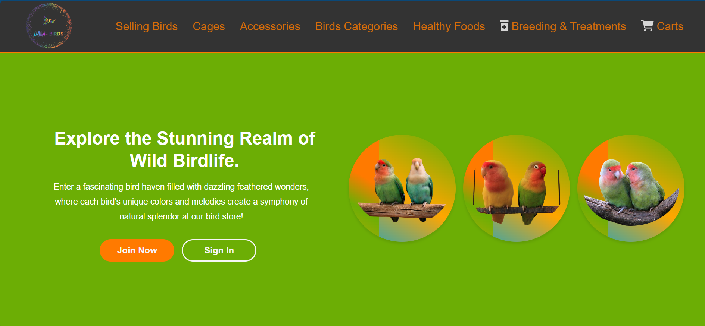


  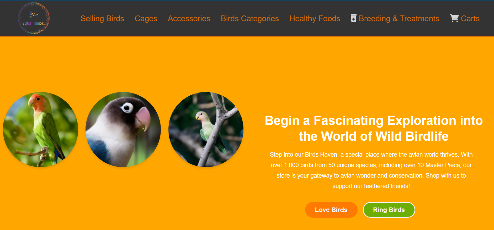

 
  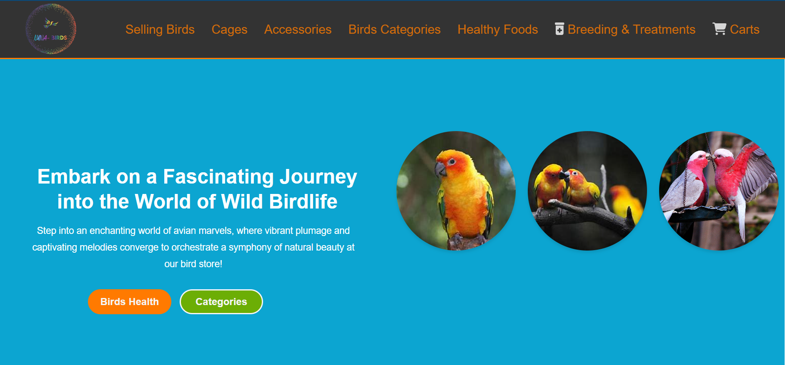


   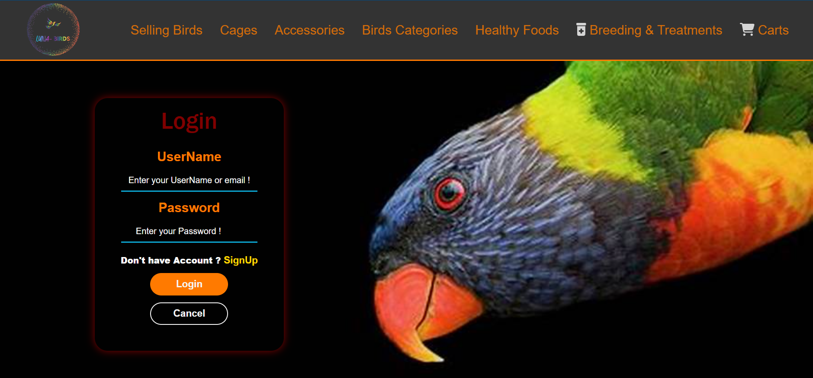
  
  
 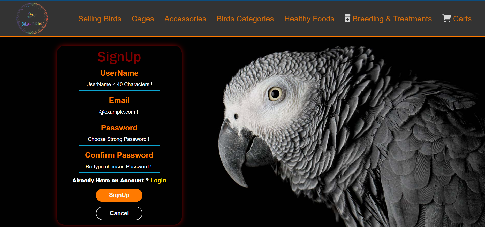
   

- **Selling Birds**: Browse a list of birds available for purchase and add them to the cart.


  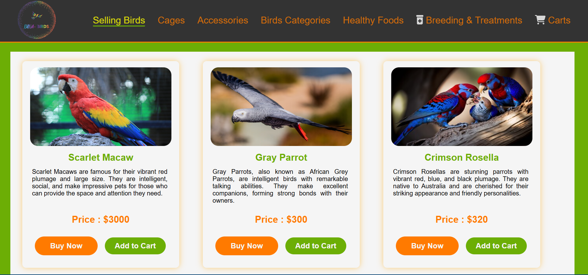  


- **Cages Page**: Explore and select bird cages.


  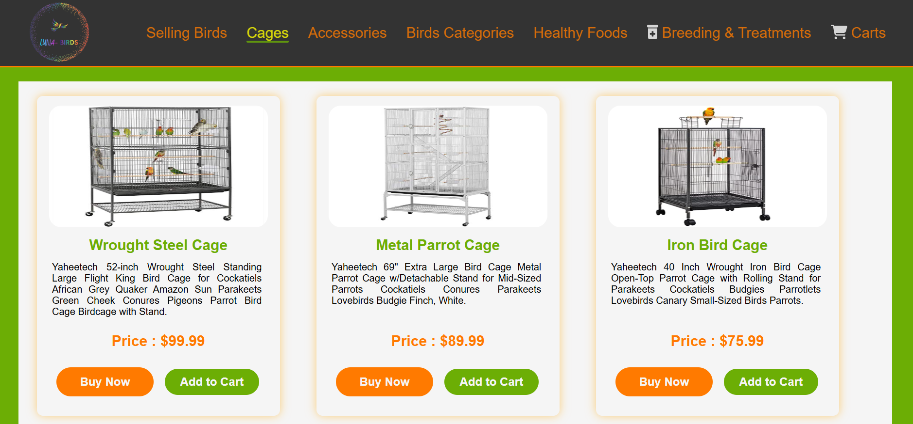
  

- **Accessories Page**: View bird accessories for purchase.


  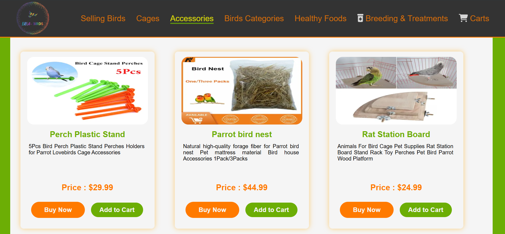
  

- **Bird Categories**: Filter birds by categories such as **Love Birds** and **Ring Birds**.


  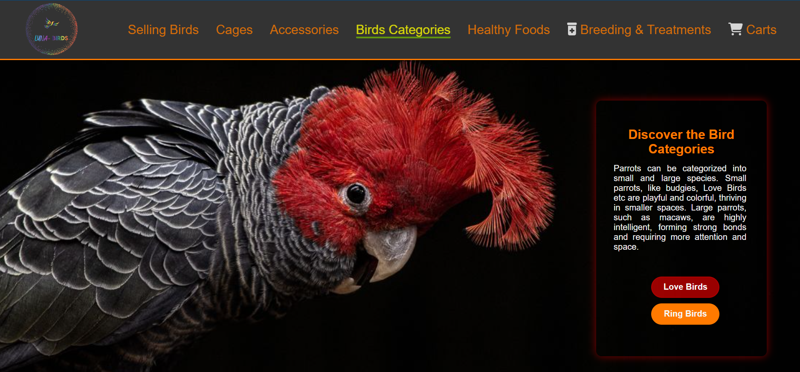
  

- **Healthy Foods**: A curated list of healthy food options for birds.


 
  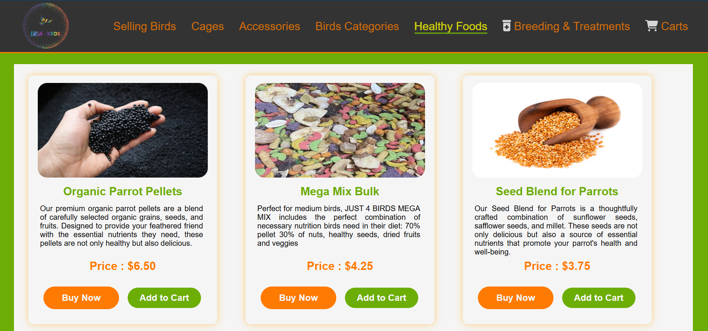
  

- **Breeding & Treatments**: Medications and products for disease treatment and breeding support.


  
  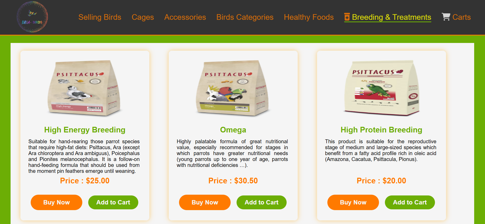
  

- **Cart Page**: A dynamic cart where users can view and manage their selected items.


  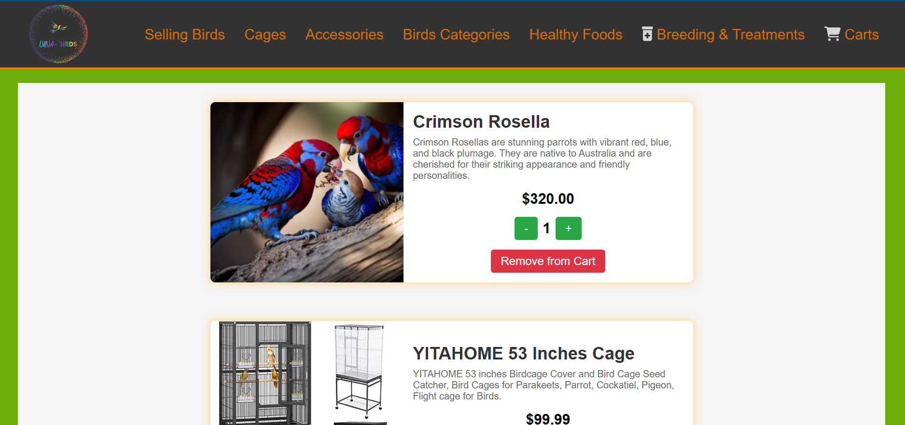  


## 🛠️ Technologies Used  
- **Frontend**: React JS  
- **Styling**: Plain CSS  

---

## 📖 Learning Outcomes  
This project taught me:  
- The basics of React JS, including component-based architecture and state management.  
- Routing and dynamic UI development.  
- The importance of starting small and continuously improving.  

---

## 🖥️ Setup Instructions  

### Prerequisites  
Ensure you have the following installed:  
- [Node.js](https://nodejs.org/)  
- npm (comes with Node.js)  

### Installation  
1. Clone this repository:  
   ```bash
   git clone https://github.com/Hassan-SoftwareEngineer/Luna-Bird-Store.git
   cd Luna-Bird-Store
